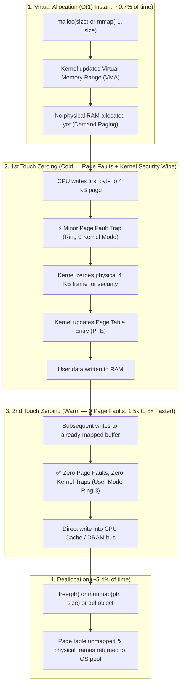

# Lesson 33: Memory Allocation, 1st Touch vs. 2nd Touch Zeroing, and Deallocation

This lesson explores the distinct phases of memory management in operating systems and Python runtimes:
1. **Virtual Address Allocation** (`malloc` / anonymous `mmap`)
2. **1st Touch Zeroing (Cold)**: Demand Paging, Minor Page Faults, Kernel Security Zeroing, DRAM Write Bandwidth
3. **2nd Touch Zeroing (Warm)**: Zero Page Faults, User-space execution, CPU Cache / Memory Bus Bandwidth
4. **Deallocation** (`free` / `munmap` / Python `del` / GC)

---

## 1. 1st Touch vs. 2nd Touch Architectural Flow

---

## 2. Benchmark Results: 64 MB Buffer Breakdown

| Phase | Operation | Time Taken | % of Total | Latency Driver |
| :--- | :--- | :--- | :--- | :--- |
| **1. Virtual Allocation** | `libc.malloc(64MB)` | **`0.054 ms`** | **0.7%** | Virtual address table reservation. |
| **2. 1st Touch Zeroing (Cold)** | `libc.memset(ptr, 0, 64MB)` | **`6.852 ms`** | **93.9%** | Allocates 16,384 physical 4 KB pages, zeroes them, and handles page fault traps (~9.12 GB/s). |
| **3. 2nd Touch Zeroing (Warm)** | `libc.memset(ptr, 0, 64MB)` | **`3.677 ms`** | — | **1.86x faster** than 1st touch (0 page faults, ~17.00 GB/s DRAM bus bound). |
| **4. Deallocation** | `libc.free(ptr)` | **`0.390 ms`** | **5.4%** | Unmapping virtual pages and returning frames to OS. |

---

## 3. Multi-Size Scalability Benchmark (128 KB to 64 MB)

| Buffer Size | 1. Virtual Alloc (`malloc`) | 2. 1st Touch (`memset` Cold) | 3. 2nd Touch (`memset` Warm) | 2nd Touch Speedup | 2nd Touch Bandwidth |
| :--- | :--- | :--- | :--- | :--- | :--- |
| **128 KB** *(L1/L2)* | **0.0005 ms** (0.5 µs) | **0.0021 ms** (2.1 µs) | **0.0016 ms** (1.6 µs) | **1.3x** | **58.24 GB/s** (L1/L2 Cache) |
| **512 KB** *(L2/L3)* | **0.0006 ms** (0.6 µs) | **0.0080 ms** (8.0 µs) | **0.0075 ms** (7.5 µs) | **1.1x** | **60.85 GB/s** (L2/L3 Cache) |
| **2 MB** *(L3 Cache)* | **0.0007 ms** (0.7 µs) | **0.0442 ms** (44.2 µs) | **0.0385 ms** (38.5 µs) | **1.2x** | **50.98 GB/s** (L3 Cache) |
| **8 MB** *(L3/RAM)* | **0.0010 ms** (1.0 µs) | **0.1677 ms** (167 µs) | **0.1410 ms** (141 µs) | **1.2x** | **48.91 GB/s** (L3 / RAM transition) |
| **32 MB** *(DRAM)* | **0.0173 ms** | **2.6539 ms** | **1.6210 ms** | **1.64x** | **19.28 GB/s** (DRAM Bus bound) |
| **64 MB** *(DRAM)* | **0.0216 ms** | **4.7763 ms** | **2.5601 ms** | **1.87x** | **24.41 GB/s** (DRAM Bus bound) |

---

## 4. Kernel Minor Page Faults (`ru_minflt`)

When allocating a 32 MB buffer (8,192 pages of 4 KB):
- **Virtual Allocation**: `0` page faults (`0.023 ms`).
- **1st Touch Write (Cold)**: `8,192` minor page faults (`2.145 ms`).
- **2nd Touch Write (Warm)**: `0` page faults (`0.270 ms` $\rightarrow$ **7.9x faster** on stride traversals!).

---

## 5. Architectural Takeaways

1. **Why 1st Touch is Expensive**:
   Allocating address space is cheap; physical page allocation, kernel context switching, and security zeroing are expensive.
2. **Why 2nd Touch is Fast**:
   2nd touch eliminates kernel traps and page table allocations; execution remains purely in user space and is bounded only by CPU cache/DRAM bandwidth.
3. **Why Buffer Pools Win**:
   Recycled buffers operate strictly in **2nd-touch mode**, bypassing both virtual allocation and the costly 1st-touch page fault cycle.
