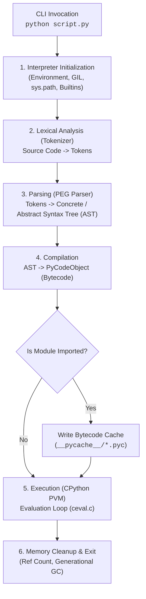
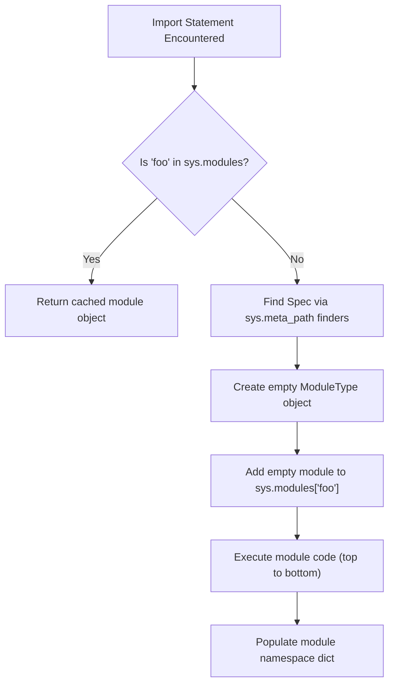
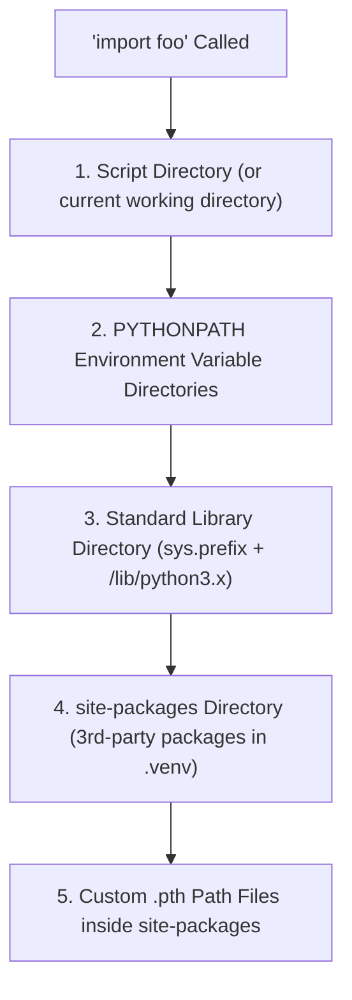
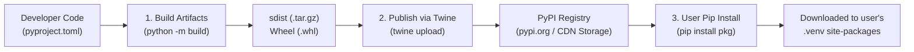

# CPython Execution Overview

When you invoke `python script.py` in your terminal, CPython (the reference Python implementation written in C) goes through a multi-stage pipeline to process and execute your code.



---

## 1. Initialization & Environment Setup
Before reading your script, CPython initializes its execution environment:
* **Argument Parsing & Config**: Reads flags (e.g., `-m`, `-c`, `-O`) and identifies the target script.
* **Core Modules**: Loads built-in modules (`sys`, `builtins`, `_thread`, etc.).
* **Search Path (`sys.path`)**: Constructs module search paths from current working directory, environment variables (`PYTHONPATH`), standard library, and `site-packages`.
* **Global Interpreter Lock (GIL) & Memory**: Initializes the GIL (in standard CPython builds) and sets up `pymalloc` (Python's customized memory allocator).

---

## 2. Parsing (Source Code $\rightarrow$ AST)

CPython does not execute raw string text directly. It converts text into an **Abstract Syntax Tree (AST)** through two stages:

1. **Tokenizing (Lexical Analysis)**: Breaks the source string into stream tokens (e.g., `NAME`, `NUMBER`, `INDENT`, `DEDENT`, `NEWLINE`).
2. **Parsing (PEG Parser)**: Since Python 3.9, CPython uses a **Parsing Expression Grammar (PEG)** parser to parse tokens into a structured tree representation (AST).

### Inspecting the AST in Python
You can inspect how Python sees your code using the built-in `ast` module:

```python
import ast

code = "x = 1 + 2"
tree = ast.parse(code)
print(ast.dump(tree, indent=4))
```
**Output AST Representation:**
```text
Module(
    body=[
        Assign(
            targets=[Name(id='x', ctx=Store())],
            value=BinOp(
                left=Constant(value=1),
                op=Add(),
                right=Constant(value=2)))],
    type_ignores=[])
```

---

## 3. Compilation (AST $\rightarrow$ Bytecode)

The CPython compiler walks the AST and translates high-level constructs into low-level **stack-based bytecode instructions**.

* **Code Object (`PyCodeObject`)**: The output of compilation. It contains:
  * `.co_code`: Raw sequence of bytecode instruction opcodes and arguments.
  * `.co_consts`: Tuple of literal constants used in code.
  * `.co_names`: Tuple of global/attribute names used.
  * `.co_varnames`: Tuple of local variable names.

* **Bytecode Caching (`.pyc` files)**:
  * When Python imports a module, CPython writes compiled bytecode to `__pycache__/<name>.<python-version>.pyc`.
  * On subsequent runs, if the source file hasn't changed, Python skips parsing & compilation by loading the `.pyc` file directly. (Note: The main script executed directly via `python script.py` is compiled in memory and typically not cached to disk).

### Inspecting Bytecode with `dis`
The `dis` (disassembler) module shows the generated bytecode instructions:

```python
import dis

def add(a, b):
    return a + b

dis.dis(add)
```

**Bytecode Output:**
```text
  LOAD_FAST                0 (a)
  LOAD_FAST                1 (b)
  BINARY_OP                0 (+)
  RETURN_VALUE
```

---

## 4. Execution / Virtual Machine Evaluation Loop

CPython's runtime engine is a **Stack-Based Virtual Machine** (Python Virtual Machine or PVM).

### Frame Objects (`PyFrameObject`)
When functions are called, CPython creates a **Call Frame** containing:
* A **Value Stack** (used to push arguments, evaluate opcodes, and pop results).
* Local variables array.
* Global and builtin namespace references.
* Instruction pointer (`co_instr`).

### The Evaluation Loop (`ceval.c`)
The heart of CPython is an evaluation loop (historically in `ceval.c`, optimized via adaptive bytecode in Python 3.11+):
1. **Fetch**: Reads the next instruction opcode from `.co_code`.
2. **Decode**: Matches opcode (`LOAD_FAST`, `BINARY_OP`, `CALL`, etc.).
3. **Execute**: Executes the corresponding C implementation.
   * `LOAD_FAST 0`: Pushes variable `a` onto the frame's evaluation stack.
   * `LOAD_FAST 1`: Pushes variable `b` onto the stack.
   * `BINARY_OP`: Pops `b` and `a`, computes `a + b`, and pushes the result back onto the stack.
   * `RETURN_VALUE`: Pops the top stack value and returns it to the caller frame.

---

## 5. Modules, Packages, and Import Machinery

### Modules vs. Packages
* **Module**: A single `.py` file containing Python code (functions, classes, variables). Example: `math.py`, `utils.py`.
* **Package**: A directory containing Python modules and an `__init__.py` file (or a namespace package directory without `__init__.py` in Python 3.3+). Allows dot-notation imports (`mypackage.utils`).

### How `import` Works Under the Hood
When Python encounters `import foo` or `from foo import bar`:



1. **Cache Check (`sys.modules`)**: Python checks `sys.modules`, a global dict of loaded modules. If present, it returns the cached module object immediately.
2. **Module Finding**: If not cached, `sys.meta_path` finders search `sys.path` to locate the module source file.
3. **Registration**: Python creates an **empty module object** `types.ModuleType("foo")` and adds it to `sys.modules['foo']` *before* executing the source code.
4. **Execution**: Python executes the module source top-to-bottom to populate its namespace dictionary (`module.__dict__`).

---

## 6. Circular Dependencies & Resolution

### What is a Circular Dependency?
A circular import occurs when Module A imports Module B, and Module B imports Module A (directly or indirectly).

#### Why it fails:
```python
# a.py
from b import bar  # Pauses execution of a.py to load b.py

def foo():
    return "foo"

# b.py
from a import foo  # Finds 'a' in sys.modules (empty/partially initialized!), tries to read 'foo' -> FAIL!

def bar():
    return "bar"
```

**Error**: `ImportError: cannot import name 'foo' from partially initialized module 'a' (most likely due to a circular import)`

Because `sys.modules['a']` was added as an empty object before executing `a.py`, when `b.py` attempts `from a import foo`, `foo` has not yet been defined because `a.py` paused at line 1!

### Strategies to Fix Circular Dependencies
1. **Refactor Shared Code (Extraction)**: Extract shared code into a 3rd module (`common.py` or `models.py`) imported by both.
2. **Import Module Instead of Symbol**: Use `import a` instead of `from a import foo`, resolving `a.foo()` at call time.
3. **Deferred / Local Import**: Place `import` statements inside functions so they execute at runtime when invoked.
4. **Type Checking Guard (`typing.TYPE_CHECKING`)**: Wrap type-hint-only imports inside `if TYPE_CHECKING:`.

---

## 7. Virtual Environments & Physical Disk Layout

### What is a Virtual Environment?
A virtual environment is an isolated directory tree containing a specific Python executable and its own independent set of installed packages (`site-packages`).

```text
my_project/
├── .venv/                              # Virtual Environment Directory
│   ├── pyvenv.cfg                      # Redirect configuration file
│   ├── bin/ (or Scripts/ on Windows)
│   │   ├── python -> /usr/bin/python3  # Symlink to system CPython binary
│   │   ├── pip                         # Pip binary bound to this venv
│   │   └── activate                    # Shell script to update $PATH & $VIRTUAL_ENV
│   ├── include/                        # C headers for native extensions
│   └── lib/python3.x/
│       └── site-packages/              # Physical location of installed 3rd-party packages
│           ├── requests/               # Package source files
│           └── requests-2.31.0.dist-info/ # Package metadata & entry points
└── main.py
```

### How Virtual Environments Work Under the Hood
1. **The `pyvenv.cfg` File**: When `.venv/bin/python` is invoked, CPython reads `pyvenv.cfg` located in its parent folder.
2. **Prefix Redirection**:
   * `sys.base_prefix`: Points to the system CPython installation (`/usr`).
   * `sys.prefix`: Redirects to `.venv/`.
3. **Site-Packages Resolution**: Python's `site.py` module uses `sys.prefix` to append `.venv/lib/python3.x/site-packages` to `sys.path`.
4. **Isolation**: Running `pip install` writes packages strictly into `.venv/lib/python3.x/site-packages`, keeping system Python clean.

---

## 8. Module Search Path (`sys.path`) & Resolution Order

When you type `import foo`, CPython searches `sys.path` in the following strict order:



You can inspect your active search paths at any time in Python:
```python
import sys
print(sys.path)
```

---

## 9. Physical Code Allocation & Package Management

### System vs. Virtualenv Allocation

| Component | Physical Disk Location (Linux Example) |
| :--- | :--- |
| **System CPython Binary** | `/usr/bin/python3` or `/usr/local/bin/python3` |
| **Standard Library** | `/usr/lib/python3.11/` (`os.py`, `json/`, `ast.py`) |
| **Global Site-Packages** | `/usr/local/lib/python3.11/site-packages/` or `~/.local/lib/python3.11/site-packages/` |
| **Venv Site-Packages** | `.venv/lib/python3.11/site-packages/` |

### How `pip` & Wheels Work
1. **Wheel (`.whl`)**: A pre-built ZIP archive containing Python code and optional pre-compiled C extensions (`.so` / `.pyd`).
2. **Unpacking**: `pip` extracts the wheel directly into `.venv/lib/python3.x/site-packages/`.
3. **`.dist-info` Directory**: Stores installation metadata:
   * `METADATA`: Dependencies, version, author.
   * `RECORD`: File paths and hashes for clean uninstallation (`pip uninstall`).
   * `entry_points.txt`: Maps CLI commands (e.g. `pytest`) to executable scripts in `.venv/bin/`.

---

## 10. Package Publishing & Distribution Lifecycle (PyPI)

Where do modules live on the network, and how are they released to other users?



### 1. Where Packages Live on the Network
* **PyPI (Python Package Index)**: The official public repository hosted at [`https://pypi.org/`](https://pypi.org/). Package files (`.whl`, `.tar.gz`) are stored in high-performance Object Storage / CDNs (e.g., Fastly / AWS S3).
* **Private Repositories**: Organizations use private registries like **AWS CodeArtifact**, **Google Artifact Registry**, **JFrog Artifactory**, or **Nexus** for private enterprise packages.
* **VCS Direct Installation**: `pip` can also fetch code directly from git hosts:
  `pip install git+https://github.com/username/repository.git`

---

### 2. Step-by-Step Package Release Steps

1. **Configure Metadata (`pyproject.toml`)**:
   Defines build requirements, package name, version, and dependencies:
   ```toml
   [build-system]
   requires = ["hatchling"]
   build-backend = "hatchling.build"

   [project]
   name = "my_awesome_package"
   version = "1.0.0"
   dependencies = ["requests>=2.28.0"]
   ```

2. **Build Distribution Bundles (`python -m build`)**:
   Generates two distribution formats in a `dist/` directory:
   * **Source Distribution (`.tar.gz`)**: Raw source code + build script.
   * **Built Wheel (`.whl`)**: Pre-compiled ZIP file containing ready-to-use Python packages.

3. **Upload to PyPI (`twine upload dist/*`)**:
   Uploads `dist/*` artifacts over HTTPS API to PyPI using secure API tokens.

4. **PyPI Simple Repository API**:
   PyPI updates its index at `https://pypi.org/simple/my_awesome_package/`.

5. **User Installation (`pip install my_awesome_package`)**:
   When another user runs `pip install`, `pip` queries PyPI's Simple API, retrieves the wheel URL from the CDN, downloads it, and extracts it into their `.venv/lib/python3.x/site-packages/`.

---

## 11. Memory Management & Garbage Collection

As code executes, objects are dynamically allocated in heap memory:
* **Reference Counting**: Every Python object (`PyObject`) maintains an internal reference count (`ob_refcnt`). When `ob_refcnt` drops to zero, memory is freed immediately.
* **Generational Cycle GC**: Detects and breaks cyclic references using 3 generation tiers (Gen 0, Gen 1, Gen 2).

---

## 12. Shutdown & Cleanup
When execution reaches the end of the main script or `sys.exit()` is called:
1. `sys.is_finalizing()` becomes `True`.
2. `atexit` callbacks and `__del__` destructors run.
3. Modules are cleared (`sys.modules`).
4. Memory allocators release remaining allocated blocks and the interpreter process exits.
